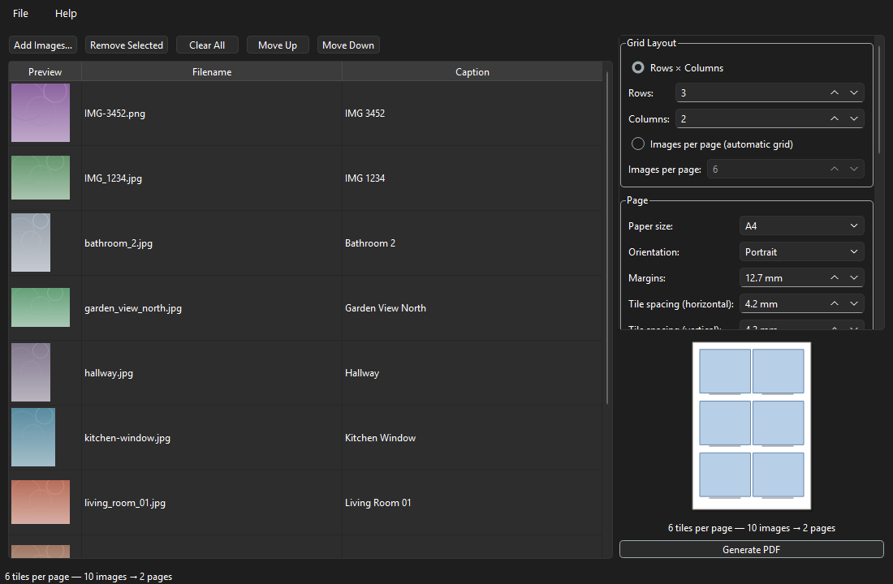

# PDF Tile Generator

A cross-platform desktop application that creates printable **PDF contact sheets**:
pages of image tiles with captions automatically generated from the filenames.

`living_room_01.jpg` → **Living Room 01** &nbsp;·&nbsp; `IMG-3452.PNG` → **IMG 3452** &nbsp;·&nbsp; `my-dog sleeping.jpeg` → **My Dog Sleeping**

Offline by default: no accounts, no telemetry, no background network activity.
The only network access is the optional **Check for Updates** button in
Help → About — and only when you click it.



## Features

- Add images by file dialog or **drag-and-drop**; reorder, remove, multi-select
- Supported formats: JPG, JPEG, PNG, BMP, TIF, TIFF, WEBP
- Grid layout: explicit **rows × columns** or automatic from **images per page**
- Paper sizes A4 / Letter / Legal / A3, **custom dimensions**, or **Auto** —
  the page grows to fit the grid at your chosen tile size; portrait or
  landscape, adjustable margins, tile spacing, and caption spacing
- Per-image **descriptions** rendered under captions, plus **custom columns**
  (Add Column…) for any additional information under each tile
- **CSV import/export** for bulk editing (`filename,caption,description,…`);
  unknown CSV headers become custom columns automatically
- Image placement: **fit within tile** or **crop to fill** (aspect ratio always preserved)
- Caption options: font, size, alignment, color, max lines, wrapping, Title Case
- **Per-image caption editing** — double-click any caption in the list
- Live page-layout preview with page count estimate
- Background generation with **progress bar and Cancel**; handles 500+ images
- Robust error handling: corrupt/missing images are skipped (with a report),
  never crash the app; existing files are never overwritten without confirmation
- Remembers your settings, window layout, and last-used folders between runs
- **In-app updates** on Windows (Help → About → Check for Updates): the
  installed build downloads only what changed and installs on restart. Other
  builds fall back to opening the download page. Always user-initiated.

An example output is included at
[examples/example_contact_sheet.pdf](examples/example_contact_sheet.pdf)
(generated from [examples/images/](examples/images/) by `scripts/make_examples.py`).

## Quick start (from source)

Requires Python 3.11+.

```bash
git clone <this repository>
cd pdf_tile_generator
python -m venv .venv
# Windows: .venv\Scripts\activate    macOS/Linux: source .venv/bin/activate
pip install -e .
python -m pdf_tile_generator
```

See [docs/INSTALL.md](docs/INSTALL.md) for details and
[docs/PACKAGING.md](docs/PACKAGING.md) to build standalone executables for
Windows, macOS, and Linux.

## Using the application

1. **Add Images…** (or drag files onto the window). Each image gets a caption
   generated from its filename; double-click a caption to customize it.
2. Choose your grid (rows × columns, or images per page for an automatic grid).
3. Pick paper size, orientation, margins, and caption styling. The preview on
   the right shows the resulting page layout and page count as you type.
4. Choose the output file under **Output → Browse…**.
5. Click **Generate PDF** (Ctrl+G). A progress bar appears; you can cancel at
   any time. When done, the PDF opens automatically (optional).

## Development

```bash
pip install -e .[dev]
python -m pytest tests          # run the test suite (100 tests)
black pdf_tile_generator tests  # format
ruff check pdf_tile_generator   # lint
```

More in [docs/DEVELOPER.md](docs/DEVELOPER.md) and
[docs/ARCHITECTURE.md](docs/ARCHITECTURE.md).

## Documentation

| Document | Contents |
| --- | --- |
| [docs/INSTALL.md](docs/INSTALL.md) | Installation for users and developers |
| [docs/DEVELOPER.md](docs/DEVELOPER.md) | Dev setup, testing, code style |
| [docs/ARCHITECTURE.md](docs/ARCHITECTURE.md) | Module layout and design decisions |
| [docs/PACKAGING.md](docs/PACKAGING.md) | Building Windows/macOS/Linux releases |
| [docs/TROUBLESHOOTING.md](docs/TROUBLESHOOTING.md) | Common problems and fixes |
| [CONTRIBUTING.md](CONTRIBUTING.md) | How to contribute |

## Security & privacy

- Offline by default; the **only** network access is the user-initiated
  "Check for Updates" button in the About dialog. On the installed Windows
  build this downloads a signed-by-hash Velopack package and installs it on
  restart; other builds just open the download page. Nothing is ever
  downloaded or installed in the background.
- Images are decoded through one hardened path that rejects decompression
  bombs and treats corrupt files as skippable, never fatal
- Existing files are never overwritten without explicit confirmation
- No telemetry, no automatic updates, no shell execution

## License

MIT
